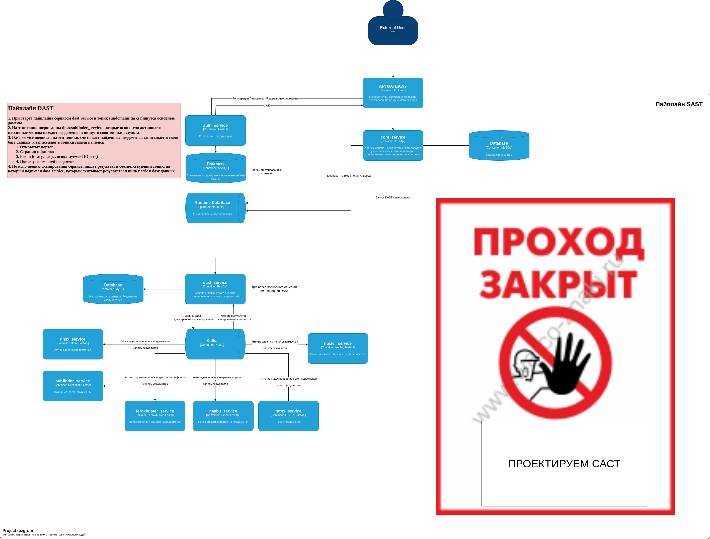

>>>## **`PROJECT_RAZGROM`**
>>> Инструмент предназначенный для специалистов безопасной разработки программного обеспечения всех видов.\
>>>Микро сервисная платформа, автоматизирующая процессы разведки, анализа и контроля безопасности внешнего периметра и исходного кода.
Система использует как и open-source решения, так и собственные разработки.  

### Внешний периметр DAST
   - `Сбор поддоменов` Используются пассивные и активные методы для сбора информации о поддоменах.
   - `Рекогносцировка и анализ веб-контента` Поиск страниц, анализ содержимого, извлечение HTTP-заголовков, определение используемых технологий и CMS.
   - `Поиск уязвимостей` Выявление типовых уязвимостей веб-приложений, конфигураций и инфраструктуры исходя из известных шаблонов атак.

### Исходный код SAST/SCA 
   - `Поиск секретов` - Анализ репозиториев и исходного кода на наличие утечек конфиденциальных данных — таких, как API-ключи, токены доступа, пароли, приватные ключи и другие чувствительные артефакты, случайно оставленные в коде.
   - `Сканирование цепочки зависимостей` - Определение версий библиотек и проверка на известные уязвимости CVE/BDU
   - `Анализ исходного кода` - Обнаружение небезопасных паттернов и уязвимого кода.

### Архитектура
Продукт состоит из микро сервисной архитектуры:
1. [Сервис работы с пользователями jwt (auth_service)](app/services/auth_service/README.md)
2. [Основной сервис (core_service)](app/services/core_service/README.md)
2. [Api Gate Away (kraken D) ](app/services/kraken_d/README.md)

DRAFT
>
